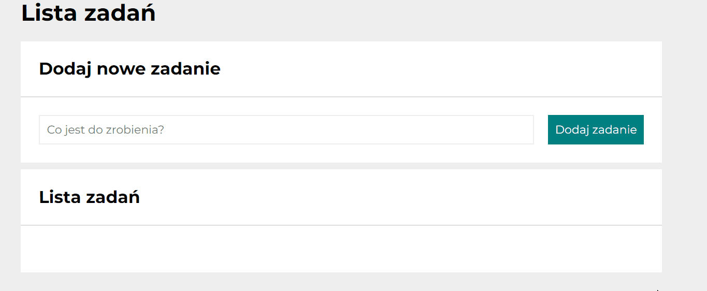
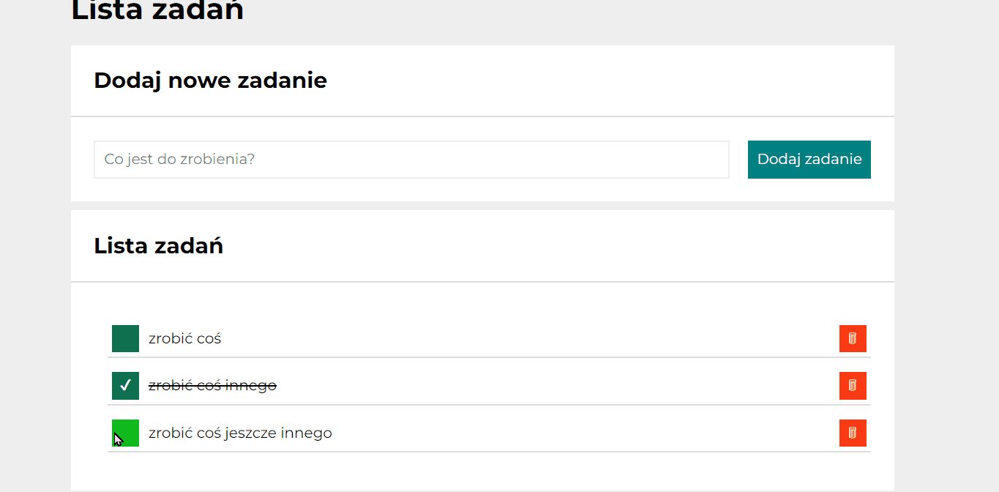
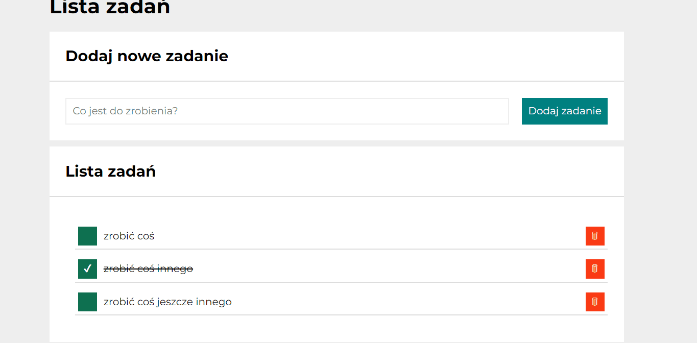

# to-do list

## Demo
https://patryk-majchrzak.github.io/tasks_list/

## Description
Hi! Welcome to my todo list, where you can create your list of tasks that can help you organize your work. 😊 Below som information for users how to navigate through the website and information for developers about code itself. So, what are you waiting for? Click th link in the demo and try it out 😉

## Details for users
1. Website is available only in polish (I am about to add language selection in thee future, so it will be available in english as well)
2. You can add new task to your to-do list by selecting the input with "Co jest do zrobienia?" (What needs to be done) text and click button with "Dodaj zadanie" (add task). Task will go to section called "lista zadań" (tasks list)

3. You can select existing tasks by
- clicking green button which changes tasks status from not done to done and from done to not done

 

- clicking red button which removes task entirely

## Details for developers

1. JavaScript code has been closed in a block to avoid setting global functions or variables
2. All JS interactions are closed in separated functions with function init called as a first one and then calling one further interactions
3. For naming classes for HTML mark-ups I've used BEM convention for any class I was using in CSS. For classes used in JS I used prefixes "js-". All of them are written in camelCase
4. I used media queries to change how website will be displayed on various devices