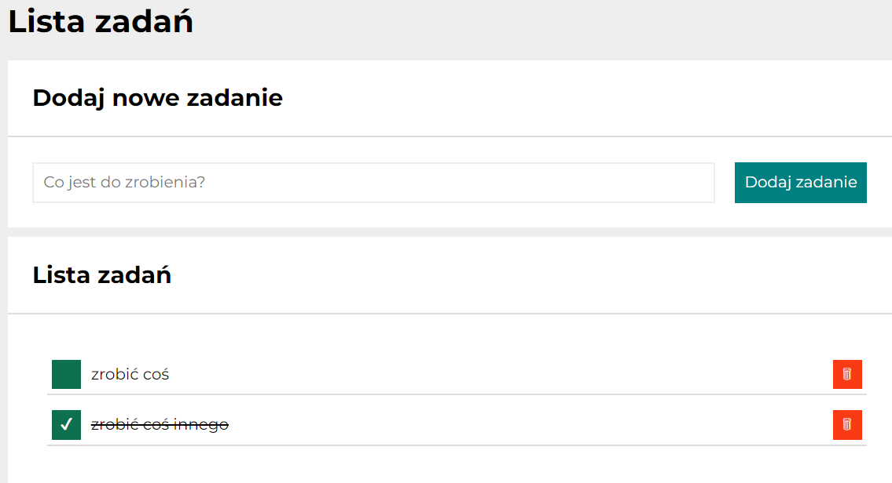

# TO-DO LIST

## Demo
https://patryk-majchrzak.github.io/to-do_list/

## Description
Hi! Welcome to my todo list, where you can create your list of tasks that can help you organize your work. 😊 Below som information for users how to navigate through the website and information for developers about code itself. So, what are you waiting for? Click th link in the demo and try it out 😉

## Details for users
1. Website is available only in polish (I am about to add language selection in thee future, so it will be available in english as well)
2. After starting the website for the first time, you should see two example tasks called "zrobić coś" (do something) and "zrobić coś innego" (do something else). "Zrobić coś innego" should be crossed out as it is marked as done. Also there will be two options called "ukryj ukończone" (hide done) and ukończ wszystkie (finish all). You should see same two tasks after refreshing the page

3. You can add new task to your to-do list by selecting the input with "Co jest do zrobienia?" (What needs to be done) text and click button with "Dodaj zadanie" (add task). Task will go to section called "lista zadań" (tasks list)

4. You can select existing tasks by
- clicking green button which changes tasks status from not done to done and from done to not done

 

- clicking red button which removes task entirely

5. You can mark all tasks as done by clicking "ukończ wszystkie" (finish all) you can mark all tasks as done

6. You also can hide all tasks that are done by clicking "Ukryj ukończone" (hide done) which hides all done tasks and chcnges text into "pokaż ukończone" (show done). If you click on the text once again all done tasks will show up again

## Details for developers

1. JavaScript code has been closed in a block to avoid setting global functions or variables
2. All JS interactions are closed in separated functions with function init called as a first one and then calling one further interactions
3. For naming classes for HTML mark-ups I've used BEM convention for any class I was using in CSS. For classes used in JS I used prefixes "js-". All of them are written in camelCase
4. I used media queries to change how website will be displayed on various devices
5. Code has been written with regard to immutability. Arrays and objects aren't modified, they are replaced with new ones